# 🌐 Social Network Showcase

Dive into the future of social media interaction with our cutting-edge application, crafted with **Flutter**! 🚀

## 🌟 Key Highlights of Our App

- **🗨️ Chatting**: Effortlessly connect with friends and family through seamless, real-time messaging. Share your thoughts, experiences, and memes in style!

- **📸 Content Creation & Sharing**: Unleash your creativity! Easily craft, share, and explore captivating content that sparks conversations and inspires others.

- **🤖 AI-Powered Bot**: Meet your intelligent companion! Engage in meaningful chats with our AI-powered bot that enhances your social experience, offering tips, fun facts, and more.

- **🎨 Profiles & Customization**: Make your mark! Personalize your profile with unique settings and themes, showcasing your personality and style. Stand out in the crowd!

## 📷 Screenshots

Below are some glimpses of our app in action:

    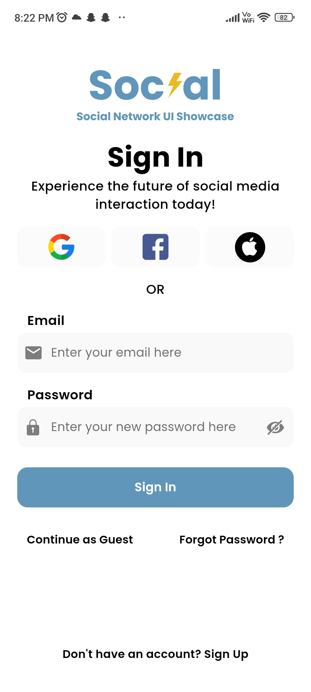
    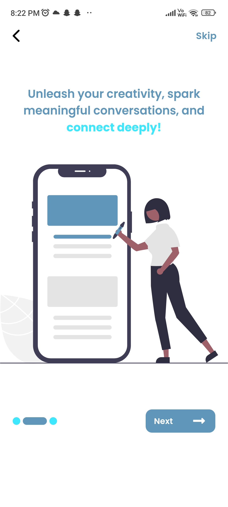
    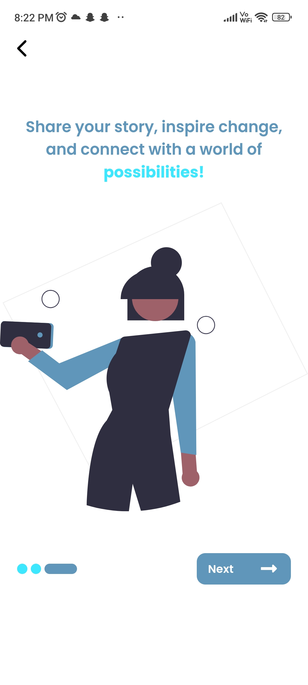
    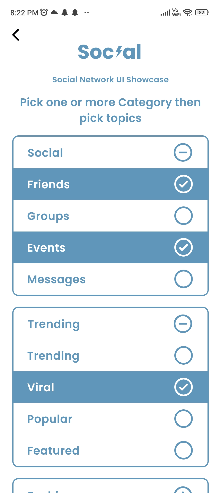
    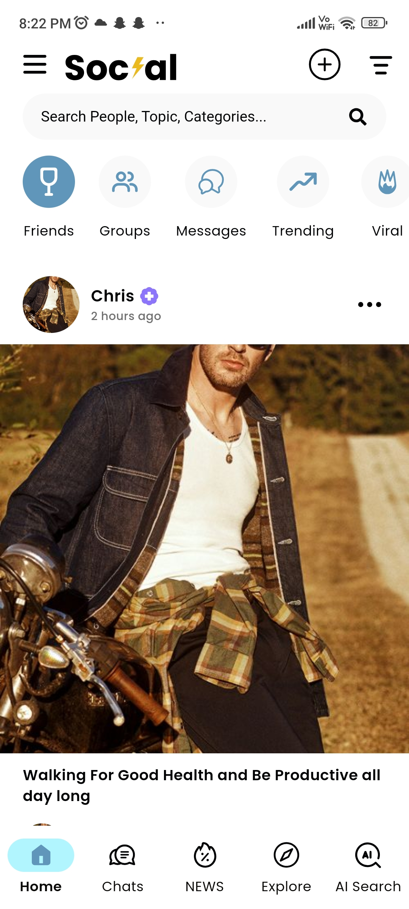
    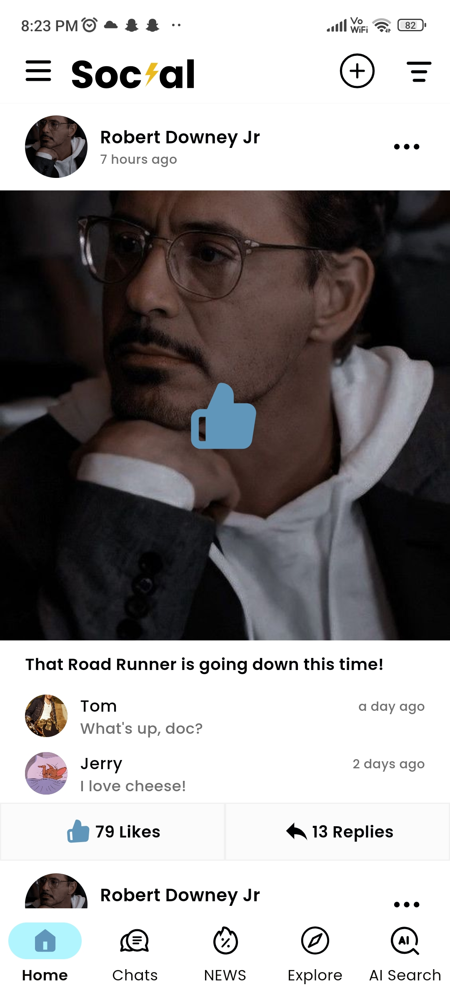
    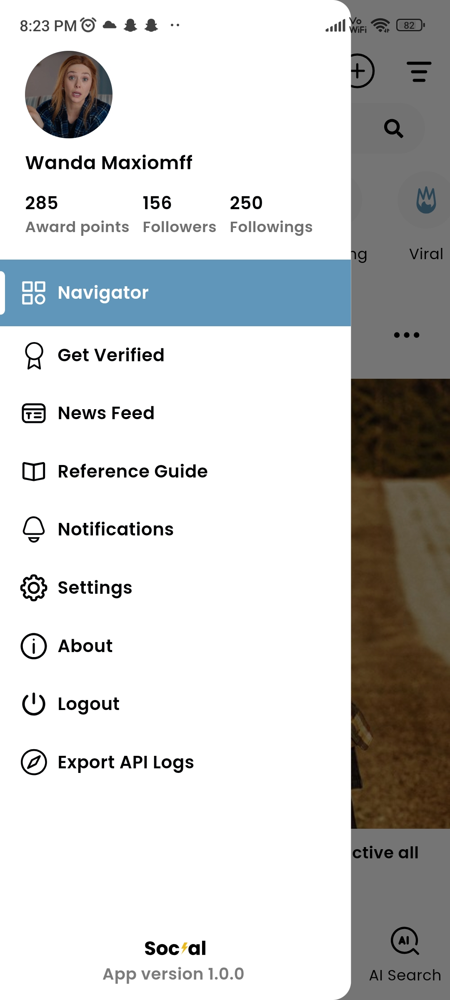
    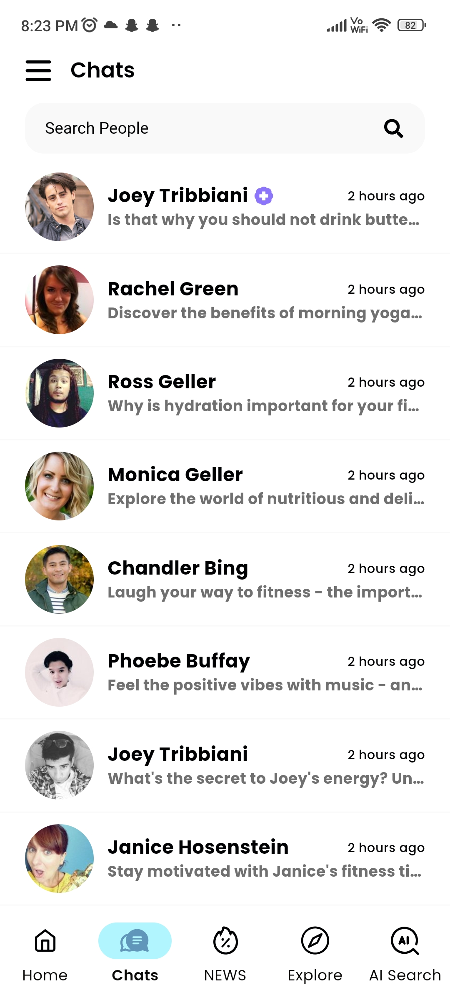
    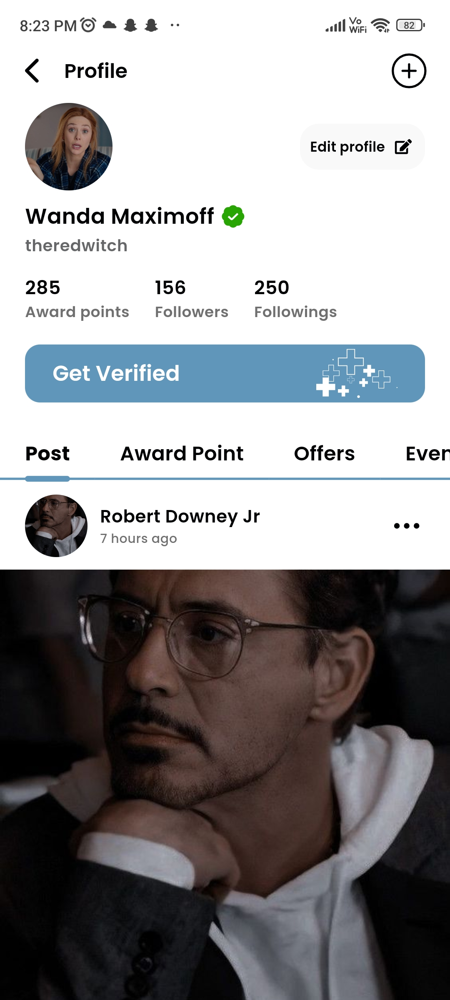
    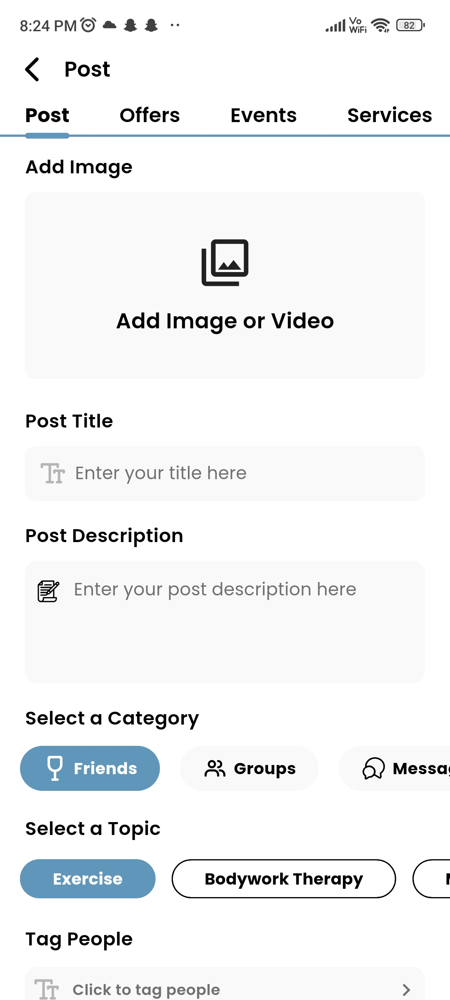
    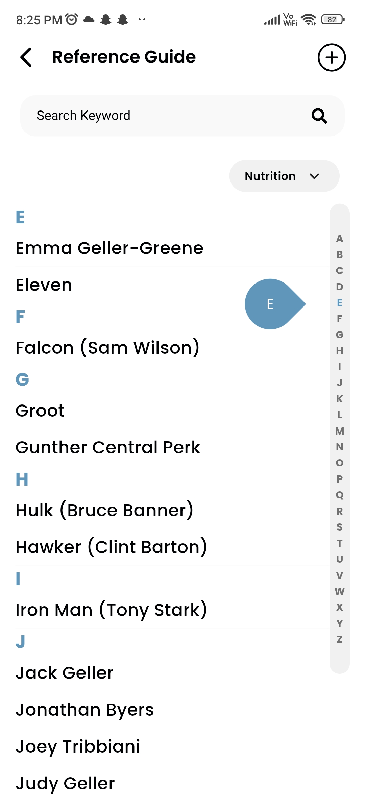
    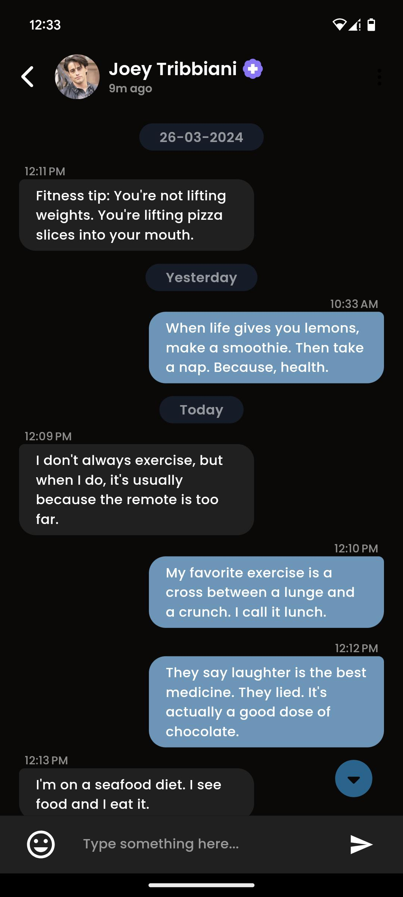

